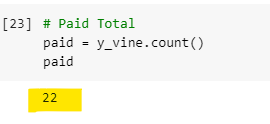
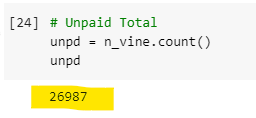
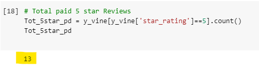
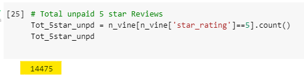
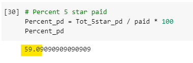
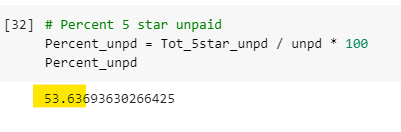
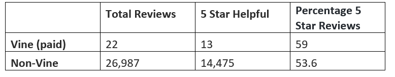

# Amazon_Vine_Analysis
Module 16 Challenge

## Overview of the analysis

The Amazon Vine program is a service that allows manufacturers and publishers to receive reviews for their products. Companies like SellBy pay a small fee to Amazon and provide products to Amazon Vine members, who are then required to publish a review. This project will be analyzing Amazon reviews written by members of the paid Amazon Vine program. A datasets with Amazon reviews for shoes was used to determine if there is any bias toward favorable reviews from Vine members in the dataset. Data results and analysis will be presented.

## Perform ETL on Amazon Product
Using knowledge of the cloud ETL process, an AWS RDS database with tables in pgAdmin is created. A dataset for shoe reviews, from the Amazon Review dataset, is used to  extract the dataset into a DataFrame. The dataFrame is transformed the into four separate DataFrames that match the table schema in pgAdmin. Then, the transformed data is uploaded into the appropriate tables and queries are run in pgAdmin to confirm that the data has been uploaded. The following date framses are used.

- customers_table
- products_table
- review_id_table
- vine_table 

## Determine Bias of Vine Reviews

- Total Vine reviews 

- Total non-Vine reviews 

- Vine reviews with 5 stars

- Non-Vine reviews with 5 stars

- Percentage of Vine reviews were 5 stars

 

- Percentage of non-Vine reviews with 5 stars

## 2.	Summary: 
For this analysis, it was determined having a paid Vine review makes little difference in the percentage of 5-star reviews. The results show that the percent of five star reviews from the Vine program is 59%, while the non-vine five star reviews were 53.6%, making only about a 5% difference. However, the total amount of Vine reviews was low, only 22 compared to almost 27,0000 for the non-vine reviews total. This could make the Vine review dataset unrelable.  

Additional analysis that can be done is to break down the shoe reviews by type of shoes.  This 

